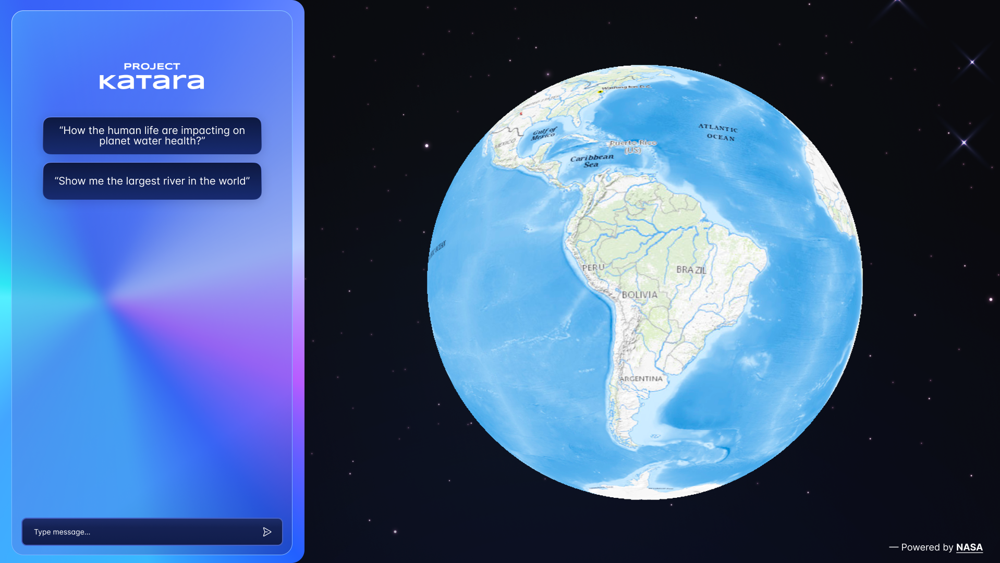

    

# Project Katara - Global Finalist Honorable Mention (NASA Space Apps 2023)
Katara is a free web application that uses NASA's satellites data for giving to users a better understandment of the path of water across the entire Earth system and how the availability of this critical resource is affected by our changing climate through an interactive application. 

## Features

The Web App Katara's interactive experience is based on a Language Model and an open-source planetary globe engine. The LM responds to user's questions about the water with geographic information in texts and on an interactive 3D globe. 

- [WorldWindJs](https://github.com/WorldWindEarth/worldwindjs) - used for displaying the interactive 3D globe, which is a fork of an open-source planetary globe engine, the [Web WorldWind](https://worldwind.arc.nasa.gov/web/) platform.

- [GeoServer](https://github.com/project-katara/geoserver) - the open source software GeoServer was used for building the layers of the 3D globe.

- [LLaMA 2](https://huggingface.co/docs/transformers/main/model_doc/llama2) - LLaMA 2 pretrained model, with average 7 billion parameters as a base, was used for building Katara LLM, however it was fine-tuned using NASA datasets and documents to answer Earth's water related questions.

- [Katara](https://huggingface.co/spaces/dkdaniz/katara) - here you can try Katara LLM chat
  

    

 

***

# React + Vite
This template provides a minimal setup to get React working in Vite with HMR and some ESLint rules.

Currently, two official plugins are available:

- [@vitejs/plugin-react](https://github.com/vitejs/vite-plugin-react/blob/main/packages/plugin-react/README.md) uses [Babel](https://babeljs.io/) for Fast Refresh
- [@vitejs/plugin-react-swc](https://github.com/vitejs/vite-plugin-react-swc) uses [SWC](https://swc.rs/) for Fast Refresh

***

# References
All of the sources that helped building the project, such as datasets, documents and libraries, are listed as a reference.

## Repositories

- [GeoServer](https://github.com/project-katara/geoserver)
- [Katara](https://huggingface.co/spaces/dkdaniz/katara)
- [Web WorldWind](https://worldwind.arc.nasa.gov/web/)
- [WorldWindJs](https://github.com/WorldWindEarth/worldwindjs)
  
## Documents

- [Accelerated sea ice loss in the Wandel Sea points to a change in the Arctic’s Last Ice Area](https://www.nature.com/articles/s43247-021-00197-5)
- [Arctic Report Card](https://arctic.noaa.gov/Report-card/)
- [Arctic Sea Ice 6th Lowest on Record; Antarctic Sees Record Low Grow...](https://climate.nasa.gov/news/3284/arctic-sea-ice-6th-lowest-on-record-antarctic-sees-record-low-growth/)
- [Arctic Sea Ice Minimum | NASA Global Climate Change](https://climate.nasa.gov/vital-signs/arctic-sea-ice/)
- [Carbon Dioxide Concentration](https://climate.nasa.gov/vital-signs/carbon-dioxide/)
- [Climate Change Evidence: How Do We Know?](https://climate.nasa.gov/evidence/)
- [Earth Observing Dashboard](https://eodashboard.org/explore)
- [Global Surface Temperature](https://climate.nasa.gov/vital-signs/global-temperature/)
- [Ice Sheets | NASA Global Climate Change](https://climate.nasa.gov/vital-signs/ice-sheets/)
- [JPL Drought Monitoring](https://grace.jpl.nasa.gov/applications/drought-monitoring/)
- [JPL - GRACE-FO](https://grace.jpl.nasa.gov/mission/grace-fo/)
- [JPL - Gravity Recovery and Climate Experiment Grace](https://www.jpl.nasa.gov/missions/gravity-recovery-and-climate-experiment-grace)
- [JPL - Flood Potential](https://grace.jpl.nasa.gov/applications/flood-potential/)
- [JPL - Groundwater](https://grace.jpl.nasa.gov/applications/groundwater/)
- [JPL - History](https://www.jpl.nasa.gov/who-we-are/history)
- [Improving health and reducing poverty through water safety and quality](https://www.who.int/activities/improving-water-safety)
- [JPL - Mission Description](https://smap.jpl.nasa.gov/mission/description/)
- [LLaMA 2](https://huggingface.co/docs/transformers/main/model_doc/llama2)
- [Methane | Vital Signs](https://climate.nasa.gov/vital-signs/methane/)
- [NASA Climate Kids](https://climatekids.nasa.gov/carbon/)
- [NASA Global Climate Change: Sustainability and Government Resources](https://climate.nasa.gov/solutions/resources/)
- [Ocean Heat Content | NASA Global Climate Change](https://climate.nasa.gov/vital-signs/ocean-warming/)
- [Oceans Melting Greenland](https://omg.jpl.nasa.gov/)
- [Overview | Mission - AIRS](https://airs.jpl.nasa.gov/mission/overview/)
- [PIOMAS Artic Sea Ice Volume Reanalysis](http://psc.apl.uw.edu/research/projects/arctic-sea-ice-volume-anomaly/)
- [SMAP Mission Description](https://smap.jpl.nasa.gov/mission/why-it-matters/)
- [Solimões and Negro Rivers](https://www.nasa.gov/image-article/solim%C3%B5es-negro-rivers/)
- [SWOT Mission | Overview](https://swot.jpl.nasa.gov/mission/overview/)
- [The Causes of Climate Change](https://climate.nasa.gov/causes/)
- [The Effects of Climate Change](https://climate.nasa.gov/effects/)
- [The Global Precipitation Measurement Mission (GPM)](https://gpm.nasa.gov/missions/GPM)
- [Water Cycle](https://www.nasa.gov/general/water-cycle/.)
- [Water, sanitation and hygiene (WASH)](https://www.who.int/health-topics/water-sanitation-and-hygiene-wash)
- [Agriculture and Water Management Data Pathfinder](https://www.earthdata.nasa.gov/learn/pathfinders/agricultural-and-water-resources-data-pathfinder)
- [What is Remote Sensing?](https://www.earthdata.nasa.gov/learn/backgrounders/remote-sensing)
- [Agriculture and Water Management Data Pathfinder - Find Data | Water Data](https://www.earthdata.nasa.gov/learn/pathfinders/agricultural-and-water-resources-data-pathfinder/find-data#water)
- [Agriculture and Water Management Data Pathfinder - Find Data | Weather Data](https://www.earthdata.nasa.gov/learn/pathfinders/agricultural-and-water-resources-data-pathfinder/find-data#weather)
- [Agriculture and Water Management Data Pathfinder - Find Data | Human Dimensions Data](https://www.earthdata.nasa.gov/learn/pathfinders/agricultural-and-water-resources-data-pathfinder/find-data#human-dimensions)
- [What Is the Atmosphere?](https://scied.ucar.edu/learning-zone/atmosphere/what-is-atmosphere)
- [Mapping Carbon Beyond Forests: New Harmonized Global Maps of Above and Belowground Biomass Carbon](https://www.earthdata.nasa.gov/learn/articles/biomass-carbon-density)
- [Harmonized global maps of above and belowground biomass carbon density in the year 2010](https://www.nature.com/articles/s41597-020-0444-4)
- [Stressful Summer for Coral Reefs](https://earthobservatory.nasa.gov/images/151945/stressful-summer-for-coral-reefs)
- [Drought on the Rio Negro](https://earthobservatory.nasa.gov/images/151961/drought-on-the-rio-negro)
- [Lake Urmia Shrivels Again](https://earthobservatory.nasa.gov/images/151913/lake-urmia-shrivels-again)
- [Emerald Swirls of Algae in Lake Winnipeg](https://earthobservatory.nasa.gov/images/151918/emerald-swirls-of-algae-in-lake-winnipeg)
- [The Mississippi is Mighty Parched](https://earthobservatory.nasa.gov/images/151897/the-mississippi-is-mighty-parched)
- [Climate Change Lends New Color to the Ocean](https://earthobservatory.nasa.gov/images/151894/climate-change-lends-new-color-to-the-ocean)
- [Storm Aftermath in Derna, Libya](https://earthobservatory.nasa.gov/images/151851/storm-aftermath-in-derna-libya)
- [Mussel Rafts of the Rías de Arousa](https://earthobservatory.nasa.gov/images/151746/mussel-rafts-of-the-rias-de-arousa)
- [Water Returns to Laguna de Aculeo](https://earthobservatory.nasa.gov/images/151836/water-returns-to-laguna-de-aculeo)
- [Torrential Rain Wreaks Havoc in Libya](https://earthobservatory.nasa.gov/images/151826/torrential-rain-wreaks-havoc-in-libya)
- [Hurricane Lee Traverses the Warm Atlantic](https://earthobservatory.nasa.gov/images/151822/hurricane-lee-traverses-the-warm-atlantic)
- [Greece's Agricultural Heartland Underwater](https://earthobservatory.nasa.gov/images/151816/greeces-agricultural-heartland-underwater)
- [Cloudy Waters in Missisquoi Bay](https://earthobservatory.nasa.gov/images/151799/cloudy-waters-in-missisquoi-bay)
- [Atmospheric Rivers Swamp Central Chile](https://earthobservatory.nasa.gov/images/151783/atmospheric-rivers-swamp-central-chile)
- [Panama Canal Traffic Backup](https://earthobservatory.nasa.gov/images/151778/panama-canal-traffic-backup)
- [Sea Surface Temperature](https://earthobservatory.nasa.gov/global-maps/MYD28M)
- [Chlorophyll](https://earthobservatory.nasa.gov/global-maps/MY1DMM_CHLORA)
- [The Ocean Has a Fever](https://earthobservatory.nasa.gov/images/151743/the-ocean-has-a-fever)
- [Hilary Soaks the Southwest](https://earthobservatory.nasa.gov/images/151733/hilary-soaks-the-southwest)
- [A Dynamic Day Over the Canary Islands](https://earthobservatory.nasa.gov/images/151711/a-dynamic-day-over-the-canary-islands)
- [A Series of Inundating Events](https://earthobservatory.nasa.gov/images/151664/a-series-of-inundating-events)
- [A Bloom in a Changing Barents Sea](https://earthobservatory.nasa.gov/images/151667/a-bloom-in-a-changing-barents-sea)
- [Vancouver Island's Colorful Coastline](https://earthobservatory.nasa.gov/images/151650/vancouver-islands-colorful-coastline)
